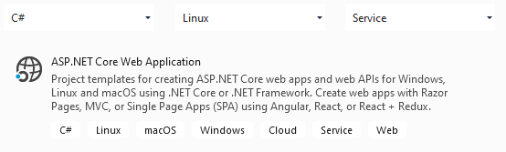
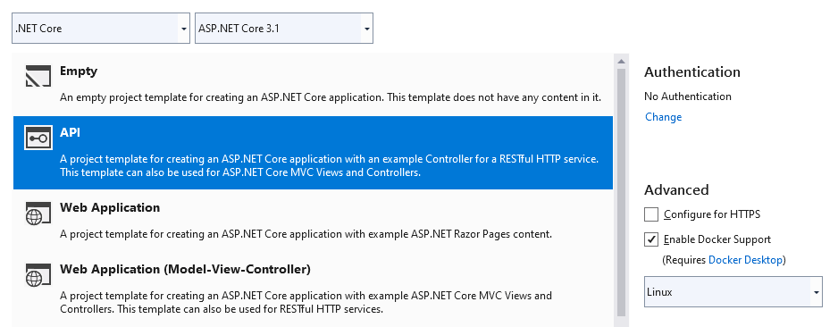

# How This Was Created
## Visual Studio project templates



## Further VS Stuff
 + &rarr; [Get started with Swashbuckle and ASP.NET Core](https://docs.microsoft.com/en-us/aspnet/core/tutorials/getting-started-with-swashbuckle?view=aspnetcore-3.1&tabs=visual-studio)
 + &rarr; [Visual Studio 2019 Launch: Docker all the things!](https://youtu.be/Tlswgxl_Xyk)

## MongoDB
 + &rarr; [Getting Started With MongoDB As A Docker Container Deployment](https://www.thepolyglotdeveloper.com/2019/01/getting-started-mongodb-docker-container-deployment)
 + &rarr; [MongoDB C#/.NET Driver](https://docs.mongodb.com/drivers/csharp)
 + &rarr; [Quick Start: C# and MongoDB - Starting and Setup](https://www.mongodb.com/blog/post/quick-start-c-sharp-and-mongodb-starting-and-setup)

```Batchfile
docker pull mongo
docker run -d -p 27017-27019:27017-27019 --name mongodb mongo
docker exec -it mongodb bash
```
<center> &darr; </center>

```Bash
hostname -i
mongo
```
<center> &darr; </center>

```SQL
show dbs
```
