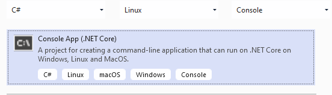
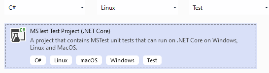

# How This Was Created
## Visual Studio project templates





## Further VS Stuff
 + &rarr; [Visual Studio 2019 Launch: Docker all the things!](https://youtu.be/Tlswgxl_Xyk)
 + &rarr; [CreateAppHost runs and fails during VS design time build if project isn't already built](https://github.com/dotnet/sdk/issues/2599)

> + go to Virus & threat protection
> + Manage settings
> + Add or remove exclusions
> + Add an exclusion to the parent folder for all your repositories

## MongoDB
 + &rarr; [Getting Started With MongoDB As A Docker Container Deployment](https://www.thepolyglotdeveloper.com/2019/01/getting-started-mongodb-docker-container-deployment)
 + &rarr; [MongoDB C#/.NET Driver](https://docs.mongodb.com/drivers/csharp)
 + &rarr; [Quick Start: C# and MongoDB - Starting and Setup](https://www.mongodb.com/blog/post/quick-start-c-sharp-and-mongodb-starting-and-setup)
 + &rarr; [Quick Start: C# and MongoDB - Read Operations](https://www.mongodb.com/blog/post/quick-start-c-and-mongodb--read-operations)
 + &rarr; [Quick Start: C# and MongoDB - Creating Documents](https://www.mongodb.com/blog/post/quick-start-c-sharp-and-mongodb--creating-documents)

```Batchfile
docker pull mongo
docker run -d -p 27017-27019:27017-27019 --name mongodb mongo
docker exec -it mongodb bash
```
<center> &darr; </center>

```Bash
hostname -i
mongo
```
<center> &darr; </center>

```SQL
show dbs
use articletrendings
db.trendings.save({ type: "short", ids: [2, 7] })
db.trendings.find()
```
